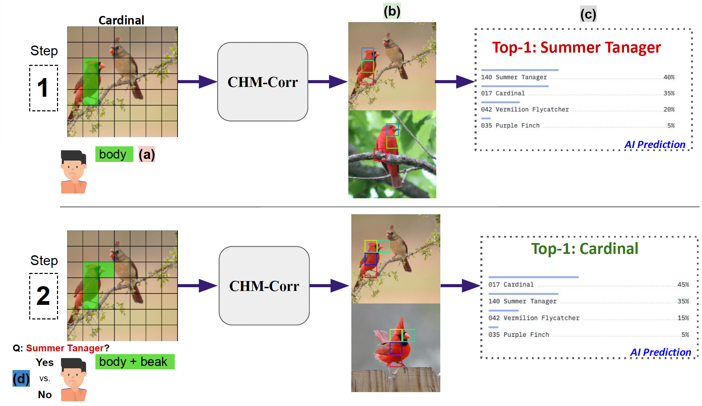

# Allowing humans to interactively guide machines where to look does not always improve human-AI team’s classification accuracy



Try the interactive UI [here](http://137.184.82.109:7080/).


## How to run

Ensure Uvicorn is installed:

```bash
pip install uvicorn
```

Run your application:

```bash
uvicorn main:app --reload --host 0.0.0.0 --port 7080
```

Visit `http://localhost:7080` in your browser. Use `--host 127.0.0.1` for local access only. Remove `--reload` for production.


# References

[1] Visual correspondence-based explanations improve AI robustness and human-AI team accuracy, NeurIPS 2022

[2] HIVE: Evaluating the Human Interpretability of Visual Explanations, ECCV 2022
